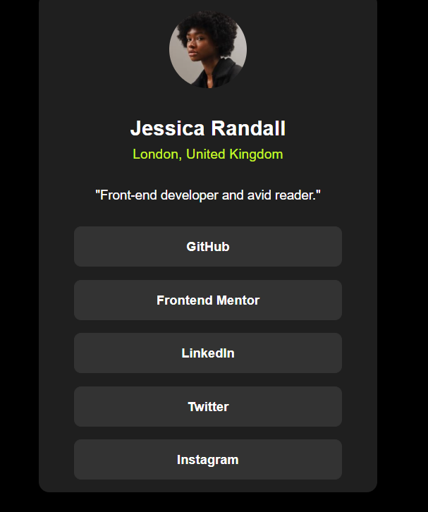

# Frontend Mentor - Social links profile solution

This is a solution to the [Social links profile challenge on Frontend Mentor](https://www.frontendmentor.io/challenges/social-links-profile-UG32l9m6dQ). Frontend Mentor challenges help you improve your coding skills by building realistic projects. 

## Table of contents

- [Overview](#overview)
  - [The challenge](#the-challenge)
  - [Screenshot](#screenshot)
  - [Links](#links)
- [My process](#my-process)
  - [Built with](#built-with)
  - [What I learned](#what-i-learned)
  - [Continued development](#continued-development)
  - [Useful resources](#useful-resources)
  - [AI Collaboration](#ai-collaboration)
- [Acknowledgments](#acknowledgments)

**Note: Delete this note and update the table of contents based on what sections you keep.**

## Overview
the design was easy, it took me longer than the others, but i didnt feel stuck and all of my coding were effeicent.
### The challenge

Users should be able to:

- See hover and focus states for all interactive elements on the page

### Screenshot

### Links

- Live Site URL: [Add live site URL here](https://mohamed-samir141.github.io/social-links-profile-main/)

## My process
thanks to perfect pixel, i have had no issues with the design at all and i think it will help me a lot in my career. but after i was done with all of the desgin, and truned off dev tools omn chrome since it hellped me being productive, i realised that the spacing was all wrong, because i have used dev tools to to resize my screen to fit the 1440px screen for desktop, the design becomes off once i turned it off

### Built with

- Semantic HTML5 markup
- CSS custom properties

### What I learned
i learned that i should plan more and be more efficient at planning so i wont get messed up later

### Continued development

i need to continue to develop my skills on spacing contents since its still my main issue.
i need to plan and highlight what i will do before better. so i wont end up messing up when i am deep into coding.
i need to configure perfect pixel better so it wont become and inconvenient every time i start a project.
### Useful resources

perfect pixel: helped me a lot to get all of the conetents just right

### AI Collaboration

i tried to use copilot for specfict wierd quirks that happends when i space contents. i ended up fixing it myself without the help of copilot

## Acknowledgments

thanks to the people who introduced the perfect pixel extenstion to me. it made me more productive